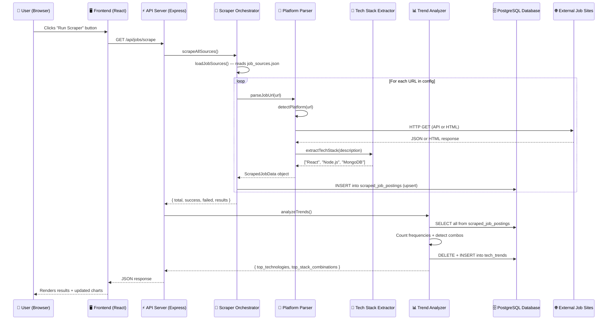
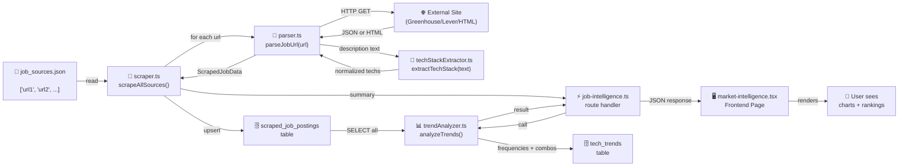

# Job Market Intelligence — Complete Scraper Workflow

This document explains the **complete end-to-end pipeline** of how the scraper works, from the moment you click "Run Scraper" on the frontend to when the trending tech stacks appear on your dashboard.

---

## Table of Contents

1. [High-Level Overview](#1-high-level-overview)
2. [Step-by-Step Workflow](#2-step-by-step-workflow)
3. [File-by-File Breakdown](#3-file-by-file-breakdown)
4. [Data Flow Diagram](#4-data-flow-diagram)
5. [Tech Stack Extraction Deep Dive](#5-tech-stack-extraction-deep-dive)
6. [Trend Analysis Deep Dive](#6-trend-analysis-deep-dive)
7. [Database Tables](#7-database-tables)
8. [API Response Examples](#8-api-response-examples)
9. [Scheduled (Automatic) Scraping](#9-scheduled-automatic-scraping)
10. [Adding Source URLs](#10-adding-source-urls)

---

## 1. High-Level Overview



---

## 2. Step-by-Step Workflow

Here is exactly what happens, in order, when you click the **"Run Scraper"** button:

---

### Step 1 — User Clicks the Button (Frontend)

**File:** [market-intelligence.tsx](file:///c:/Users/abc/OneDrive/Desktop/Minor%20Project%20Execution/Career-Stack-AI-V1/VertX/artifacts/careerstack/src/pages/market-intelligence.tsx)

When you click the **"Run Scraper"** button on the `/market-intelligence` page, this function executes:

```
handleScrape() is called
  → Sets loading state (spinner appears)
  → Makes HTTP request: GET /api/jobs/scrape
  → Waits for response
  → On success: stores scrape results in state, calls loadTrends() to refresh charts
  → loadTrends() calls: GET /api/jobs/trending-stacks
  → Updates UI with fresh data
```

The frontend uses the browser's native `fetch()` API with credentials included (for Clerk authentication cookies). The request goes to the Express backend running on port 3000.

---

### Step 2 — API Route Receives the Request (Backend)

**File:** [job-intelligence.ts](file:///c:/Users/abc/OneDrive/Desktop/Minor%20Project%20Execution/Career-Stack-AI-V1/VertX/artifacts/api-server/src/routes/job-intelligence.ts)

The Express router handles the `GET /api/jobs/scrape` endpoint:

```
Request arrives at Express
  → Passes through Clerk auth middleware (clerkMiddleware)
  → Passes through requireAdmin middleware
    → Checks if the user has admin role via Clerk
    → If not admin → returns 403 Forbidden
    → If admin → continues
  → Route handler calls scrapeAllSources()
  → After scraping completes, calls analyzeTrends()
  → Combines both results into a single JSON response
  → Sends response back to frontend
```

> [!NOTE]
> The scrape endpoint requires **admin** authentication. Only users with `role: "admin"` in their Clerk public metadata can trigger scraping. This prevents abuse.

---

### Step 3 — Scraper Orchestrator Runs (Backend)

**File:** [scraper.ts](file:///c:/Users/abc/OneDrive/Desktop/Minor%20Project%20Execution/Career-Stack-AI-V1/VertX/artifacts/api-server/src/services/job-intelligence/scraper.ts)

`scrapeAllSources()` is the main orchestrator:

```
scrapeAllSources()
  │
  ├── loadJobSources()
  │     → Reads artifacts/api-server/config/job_sources.json from disk
  │     → Parses JSON → returns { urls: [...], platforms: {...} }
  │     → If file is missing or invalid → returns empty config
  │
  ├── For each URL in config.urls:
  │     │
  │     ├── Calls parseJobUrl(url)
  │     │     → This delegates to the appropriate parser
  │     │     → Returns a ScrapedJobData object (or null on failure)
  │     │
  │     ├── If parser returned data:
  │     │     ├── Calls storeScrapedJob(data)
  │     │     │     → Builds an InsertScrapedJobPosting object
  │     │     │     → Runs INSERT ... ON CONFLICT (source_url) DO UPDATE
  │     │     │     → This means: if this URL was already scraped, update it
  │     │     │     → If it's new, insert it
  │     │     ├── Increments success counter
  │     │     └── Logs success with title + tech count
  │     │
  │     └── If parser returned null:
  │           ├── Increments failed counter
  │           └── Logs failure with error message
  │
  └── Returns summary: { total, success, failed, results[] }
```

---

### Step 4 — Platform-Specific Parsing (Backend)

**File:** [parser.ts](file:///c:/Users/abc/OneDrive/Desktop/Minor%20Project%20Execution/Career-Stack-AI-V1/VertX/artifacts/api-server/src/services/job-intelligence/parser.ts)

The parser first auto-detects which platform the URL belongs to, then calls the appropriate parser function:

```
parseJobUrl(url)
  │
  ├── detectPlatform(url)
  │     → Checks if URL contains "greenhouse.io" → returns "greenhouse"
  │     → Checks if URL contains "lever.co"      → returns "lever"
  │     → Otherwise                              → returns "generic"
  │
  ├── If "greenhouse" → parseGreenhouseJob(url)
  ├── If "lever"      → parseLeverJob(url)
  └── If "generic"    → parseGenericJob(url)
```

#### 4a. Greenhouse Parser

```
parseGreenhouseJob(url)
  │
  ├── Extract company name and job ID from URL using regex
  │     Input:  "https://boards.greenhouse.io/stripe/jobs/6356367"
  │     Match:  company = "stripe", jobId = "6356367"
  │
  ├── Build Greenhouse API URL:
  │     "https://boards-api.greenhouse.io/v1/boards/stripe/jobs/6356367"
  │     (This is Greenhouse's PUBLIC JSON API — no auth needed)
  │
  ├── HTTP GET to the API URL (axios, 15s timeout)
  │     Response is a JSON object with:
  │       - data.title          → "Senior Software Engineer"
  │       - data.company.name   → "Stripe"
  │       - data.location.name  → "San Francisco, CA"
  │       - data.content        → "<p>We're looking for...</p>" (HTML)
  │       - data.updated_at     → "2026-04-01T..."
  │
  ├── Strip HTML from data.content using cheerio
  │     → cheerio.load(htmlContent) → $.text() → plain text
  │
  ├── Extract tech stack from the plain text description
  │     → extractTechStack(descriptionText) → ["React", "TypeScript", "AWS"]
  │
  └── Return ScrapedJobData object:
        {
          title: "Senior Software Engineer",
          company: "Stripe",
          location: "San Francisco, CA",
          experience: null,
          employmentType: null,
          description: "We're looking for...",
          extractedStack: ["AWS", "React", "TypeScript"],
          postedDate: 2026-04-01T...,
          sourceUrl: "https://boards.greenhouse.io/stripe/jobs/6356367",
          sourcePlatform: "greenhouse"
        }
```

#### 4b. Lever Parser

```
parseLeverJob(url)
  │
  ├── Extract company name and job ID from URL using regex
  │     Input:  "https://jobs.lever.co/openai/abc-123-def"
  │     Match:  company = "openai", jobId = "abc-123-def"
  │
  ├── Build Lever API URL:
  │     "https://api.lever.co/v0/postings/openai/abc-123-def"
  │     (Lever's PUBLIC JSON API — no auth needed)
  │
  ├── HTTP GET to the API URL (axios, 15s timeout)
  │     Response is a JSON object with:
  │       - data.text              → Job title
  │       - data.descriptionPlain  → Plain text description
  │       - data.lists[]           → Requirements, qualifications sections
  │       - data.categories        → { location, commitment, experience, team }
  │       - data.createdAt         → Unix timestamp in milliseconds
  │
  ├── Combine all text sections (description + lists + additional) into one string
  │
  ├── Extract tech stack from combined text
  │     → extractTechStack(description) → ["Python", "Django", "PostgreSQL"]
  │
  └── Return ScrapedJobData object
```

#### 4c. Generic HTML Parser (Fallback)

```
parseGenericJob(url)
  │
  ├── HTTP GET to the URL with browser-like headers
  │     User-Agent: Chrome/120
  │     Accept: text/html
  │     (This makes the request look like a real browser)
  │
  ├── Load HTML into cheerio (jQuery-like HTML parser)
  │
  ├── Extract title (tries multiple strategies):
  │     1. <meta property="og:title"> tag
  │     2. <h1> with class containing "title", "job", or "position"
  │     3. First <h1> on the page
  │     4. <title> tag
  │
  ├── Extract company:
  │     1. <meta property="og:site_name"> tag
  │     2. Elements with class containing "company" or "org"
  │     3. Hostname of the URL
  │
  ├── Extract description (tries common selectors):
  │     1. Elements with class containing "description"
  │     2. Elements with class containing "job-detail" or "job-content"
  │     3. Elements with id containing "description"
  │     4. <article> or <main> tags
  │     5. Entire <body> text (last resort)
  │
  ├── Extract location from elements with class containing "location"
  │
  ├── Extract tech stack from the description text
  │     → extractTechStack(description) → [...]
  │
  └── Return ScrapedJobData object with sourcePlatform: "generic"
```

---

### Step 5 — Tech Stack Extraction (Backend)

**File:** [techStackExtractor.ts](file:///c:/Users/abc/OneDrive/Desktop/Minor%20Project%20Execution/Career-Stack-AI-V1/VertX/artifacts/api-server/src/services/job-intelligence/techStackExtractor.ts)

This is the "brain" of the scraper. It takes a raw job description string and returns an array of normalized technology names.

```
extractTechStack("We need a developer with ReactJS and NodeJS experience,
                  familiarity with Postgres and AWS infrastructure...")
  │
  ├── Convert description to lowercase
  │
  ├── Build a lookup map of ALL patterns:
  │     - 150+ aliases from NORMALIZATION_MAP (e.g., "reactjs" → "React")
  │     - Plus all canonical names (e.g., "React" → "React")
  │     - Total: 200+ patterns to match
  │
  ├── Sort patterns by length (longest first)
  │     Why? So "react native" matches before "react"
  │     And "spring boot" matches before "spring"
  │
  ├── For each pattern:
  │     ├── Skip if we already found this canonical tech
  │     ├── Build a regex with word boundaries
  │     │     Single-word:  /\breactjs\b/i
  │     │     Multi-word:   /(?:^|[\s,;.(])react native(?:[\s,;.)]|$)/i
  │     ├── Test regex against the description
  │     └── If match → add canonical name to the found set
  │
  └── Return sorted, deduplicated array:
        ["AWS", "Node.js", "PostgreSQL", "React"]
```

The normalization step is critical. For example, all of these map to the **same** canonical name:
- `"ReactJS"`, `"reactjs"`, `"react.js"`, `"React JS"` → **"React"**
- `"NodeJS"`, `"node"`, `"node js"`, `"Node.js"` → **"Node.js"**
- `"postgres"`, `"postgresql"`, `"Postgres"`, `"psql"` → **"PostgreSQL"**
- `"k8s"`, `"kubernetes"` → **"Kubernetes"**

---

### Step 6 — Database Storage (Backend)

**File:** [scraper.ts](file:///c:/Users/abc/OneDrive/Desktop/Minor%20Project%20Execution/Career-Stack-AI-V1/VertX/artifacts/api-server/src/services/job-intelligence/scraper.ts)

**Schema:** [scraped_jobs.ts](file:///c:/Users/abc/OneDrive/Desktop/Minor%20Project%20Execution/Career-Stack-AI-V1/VertX/lib/db/src/schema/scraped_jobs.ts)

After each URL is parsed, the data is stored using an **upsert** (insert-or-update):

```
storeScrapedJob(data)
  │
  ├── Build InsertScrapedJobPosting object from ScrapedJobData
  │
  ├── Execute SQL via Drizzle ORM:
  │     INSERT INTO scraped_job_postings (title, company, location, ...)
  │     VALUES ($1, $2, $3, ...)
  │     ON CONFLICT (source_url) DO UPDATE SET
  │       title = $1, company = $2, ..., created_at = now()
  │
  └── This means:
        - First time scraping a URL → INSERT (new row)
        - Second time scraping same URL → UPDATE (refresh data)
        - The source_url column has a UNIQUE constraint
```

---

### Step 7 — Trend Analysis (Backend)

**File:** [trendAnalyzer.ts](file:///c:/Users/abc/OneDrive/Desktop/Minor%20Project%20Execution/Career-Stack-AI-V1/VertX/artifacts/api-server/src/services/job-intelligence/trendAnalyzer.ts)

After all URLs are scraped, the API route automatically calls `analyzeTrends()`:

```
analyzeTrends()
  │
  ├── SELECT * FROM scraped_job_postings
  │     → Fetches ALL scraped jobs from the database
  │
  ├── Count technology frequencies:
  │     For each job:
  │       For each tech in job.extractedStack:
  │         techCounts[tech] += 1
  │
  │     Example result:
  │       { "React": 58, "Node.js": 46, "MongoDB": 39, "AWS": 35, ... }
  │
  ├── Calculate percentage shares:
  │     totalMentions = 58 + 46 + 39 + 35 + ... = 412
  │     React percentage = (58 / 412) × 100 = 14.08%
  │
  ├── Sort by frequency (highest first)
  │     → [{ name: "React", count: 58, percentage: 14.08 }, ...]
  │
  ├── Take top 3 technologies
  │     → ["React", "Node.js", "MongoDB"]
  │
  ├── Detect stack combinations:
  │     detectStackCombinations(techsPerJob)
  │       │
  │       ├── For each job's tech list:
  │       │     ├── Check if it contains ALL techs of MERN
  │       │     │     (MongoDB + Express + React + Node.js)
  │       │     │     If yes → comboCounts["MERN"] += 1
  │       │     ├── Check if it contains ALL techs of MEAN
  │       │     ├── Check if it contains "Python + Django + AWS"
  │       │     ├── Check if it contains "Next.js + PostgreSQL"
  │       │     └── ... (21 predefined combinations checked)
  │       │
  │       └── Return sorted: [{ stack: "MERN", count: 24 }, ...]
  │
  ├── Take top 3 stack combinations
  │
  ├── Persist to database:
  │     persistTrends(sortedTechs)
  │       ├── DELETE FROM tech_trends  (clear old data)
  │       └── INSERT INTO tech_trends (technology, frequency, trend_rank, percentage_share)
  │           VALUES ('React', 58, 1, 14.08),
  │                  ('Node.js', 46, 2, 11.17),
  │                  ('MongoDB', 39, 3, 9.47),
  │                  ...
  │
  └── Return TrendAnalysisResult:
        {
          top_technologies: [top 3],
          top_stack_combinations: [top 3],
          all_technologies: [all sorted],
          total_jobs_analyzed: 150,
          analyzed_at: "2026-04-11T..."
        }
```

---

### Step 8 — Response Sent to Frontend

**File:** [job-intelligence.ts](file:///c:/Users/abc/OneDrive/Desktop/Minor%20Project%20Execution/Career-Stack-AI-V1/VertX/artifacts/api-server/src/routes/job-intelligence.ts)

The route handler combines the scrape results and trend analysis into one response:

```json
{
  "scrape": {
    "total": 5,
    "success": 4,
    "failed": 1,
    "results": [
      { "url": "https://boards.greenhouse.io/stripe/jobs/123", "status": "success", "title": "Senior SWE", "stackCount": 8 },
      { "url": "https://jobs.lever.co/openai/abc", "status": "success", "title": "ML Engineer", "stackCount": 6 },
      { "url": "https://example.com/careers/404", "status": "failed", "error": "Request failed with status 404" }
    ]
  },
  "trends": {
    "top_technologies": [
      { "name": "React", "count": 58, "percentage": 14.08 },
      { "name": "Node.js", "count": 46, "percentage": 11.17 },
      { "name": "MongoDB", "count": 39, "percentage": 9.47 }
    ],
    "top_stack_combinations": [
      { "stack": "MERN", "count": 24 },
      { "stack": "Python + Django + AWS", "count": 18 },
      { "stack": "Next.js + PostgreSQL", "count": 14 }
    ],
    "total_jobs_analyzed": 150
  }
}
```

---

### Step 9 — Frontend Renders Results

**File:** [market-intelligence.tsx](file:///c:/Users/abc/OneDrive/Desktop/Minor%20Project%20Execution/Career-Stack-AI-V1/VertX/artifacts/careerstack/src/pages/market-intelligence.tsx)

The frontend does two things after receiving the scrape response:

1. **Shows scrape results panel** — displays each URL with success/fail status, job title, and tech count
2. **Calls `loadTrends()`** — makes a second API call to `GET /api/jobs/trending-stacks` to refresh the full trend data, which updates:
   - The Top 3 Trending Tech Stacks hero card (with animated rank medals)
   - The bar chart (top 10 technology frequency distribution)
   - The top technologies leaderboard sidebar
   - The stats row (jobs analyzed, unique technologies, stack combos found)

---

## 3. File-by-File Breakdown

Here is every file involved and its role in the pipeline:

### Config Layer
| File | Role |
|------|------|
| [job_sources.json](file:///c:/Users/abc/OneDrive/Desktop/Minor%20Project%20Execution/Career-Stack-AI-V1/VertX/artifacts/api-server/config/job_sources.json) | Stores the list of URLs to scrape. Read by `scraper.ts` at runtime. Writable by the `POST /api/jobs/add-source` endpoint. |

### Database Layer
| File | Role |
|------|------|
| [scraped_jobs.ts](file:///c:/Users/abc/OneDrive/Desktop/Minor%20Project%20Execution/Career-Stack-AI-V1/VertX/lib/db/src/schema/scraped_jobs.ts) | Drizzle ORM schema defining `scraped_job_postings` and `tech_trends` tables |
| [schema/index.ts](file:///c:/Users/abc/OneDrive/Desktop/Minor%20Project%20Execution/Career-Stack-AI-V1/VertX/lib/db/src/schema/index.ts) | Barrel export — re-exports all schemas including the new one |
| [db/index.ts](file:///c:/Users/abc/OneDrive/Desktop/Minor%20Project%20Execution/Career-Stack-AI-V1/VertX/lib/db/src/index.ts) | Creates PostgreSQL connection pool + Drizzle instance. All services import `db` from here. |

### Service Layer (Backend Logic)
| File | Role |
|------|------|
| [scraper.ts](file:///c:/Users/abc/OneDrive/Desktop/Minor%20Project%20Execution/Career-Stack-AI-V1/VertX/artifacts/api-server/src/services/job-intelligence/scraper.ts) | **Orchestrator** — reads config, loops through URLs, calls parsers, stores results in DB |
| [parser.ts](file:///c:/Users/abc/OneDrive/Desktop/Minor%20Project%20Execution/Career-Stack-AI-V1/VertX/artifacts/api-server/src/services/job-intelligence/parser.ts) | **Platform parsers** — Greenhouse API, Lever API, and generic HTML parsing via cheerio |
| [techStackExtractor.ts](file:///c:/Users/abc/OneDrive/Desktop/Minor%20Project%20Execution/Career-Stack-AI-V1/VertX/artifacts/api-server/src/services/job-intelligence/techStackExtractor.ts) | **Brain** — 150+ skill aliases, normalization map, regex extraction, and stack combo detection |
| [trendAnalyzer.ts](file:///c:/Users/abc/OneDrive/Desktop/Minor%20Project%20Execution/Career-Stack-AI-V1/VertX/artifacts/api-server/src/services/job-intelligence/trendAnalyzer.ts) | **Analytics** — counts frequencies, calculates percentages, detects combinations, persists to DB |
| [scheduler.ts](file:///c:/Users/abc/OneDrive/Desktop/Minor%20Project%20Execution/Career-Stack-AI-V1/VertX/artifacts/api-server/src/services/job-intelligence/scheduler.ts) | **Optional cron** — automated periodic scraping (disabled by default) |

### API Layer (Routes)
| File | Role |
|------|------|
| [job-intelligence.ts](file:///c:/Users/abc/OneDrive/Desktop/Minor%20Project%20Execution/Career-Stack-AI-V1/VertX/artifacts/api-server/src/routes/job-intelligence.ts) | Express routes: scrape, add-source, trending-stacks, top-3-stacks, scraped, sources |
| [routes/index.ts](file:///c:/Users/abc/OneDrive/Desktop/Minor%20Project%20Execution/Career-Stack-AI-V1/VertX/artifacts/api-server/src/routes/index.ts) | Main router — registers `jobIntelligenceRouter` alongside all existing routers |

### Frontend Layer
| File | Role |
|------|------|
| [market-intelligence.tsx](file:///c:/Users/abc/OneDrive/Desktop/Minor%20Project%20Execution/Career-Stack-AI-V1/VertX/artifacts/careerstack/src/pages/market-intelligence.tsx) | Full dashboard page — button clicks, API calls, chart rendering, result display |
| [Sidebar.tsx](file:///c:/Users/abc/OneDrive/Desktop/Minor%20Project%20Execution/Career-Stack-AI-V1/VertX/artifacts/careerstack/src/components/layout/Sidebar.tsx) | Navigation — has "Market Intel" link pointing to `/market-intelligence` |
| [AppRoutes.tsx](file:///c:/Users/abc/OneDrive/Desktop/Minor%20Project%20Execution/Career-Stack-AI-V1/VertX/artifacts/careerstack/src/components/layout/AppRoutes.tsx) | Route registration — maps `/market-intelligence` → `MarketIntelligence` component |
| [App.tsx](file:///c:/Users/abc/OneDrive/Desktop/Minor%20Project%20Execution/Career-Stack-AI-V1/VertX/artifacts/careerstack/src/App.tsx) | Root — wraps `/market-intelligence` with `ProtectedRoute` (requires login) |

---

## 4. Data Flow Diagram

This shows data transformations at each stage:



---

## 5. Tech Stack Extraction Deep Dive

The extractor in [techStackExtractor.ts](file:///c:/Users/abc/OneDrive/Desktop/Minor%20Project%20Execution/Career-Stack-AI-V1/VertX/artifacts/api-server/src/services/job-intelligence/techStackExtractor.ts) has three main capabilities:

### 5a. Normalization Map

A dictionary mapping **150+ aliases** to their canonical names:

| Raw Input | Canonical Output |
|-----------|-----------------|
| `reactjs`, `react.js`, `React JS` | **React** |
| `nodejs`, `node`, `Node JS` | **Node.js** |
| `postgres`, `postgresql`, `psql` | **PostgreSQL** |
| `k8s`, `kubernetes` | **Kubernetes** |
| `aws`, `amazon web services` | **AWS** |
| `tf`, `tensorflow` | **TensorFlow** |
| `sklearn`, `scikit-learn` | **Scikit-learn** |
| `golang`, `go lang` | **Go** |
| `csharp`, `c#` | **C#** |
| `dotnet`, `.net` | **.NET** |
| `powerbi`, `power bi` | **Power BI** |

### 5b. Regex Matching Strategy

The extractor sorts all patterns by **length descending** before matching. This prevents false matches:

```
✅ "react native" is checked BEFORE "react"
✅ "spring boot" is checked BEFORE "spring"  
✅ "google cloud platform" is checked BEFORE "google cloud" or "google"
```

For single-word patterns, it uses **word boundaries** (`\b`):
```regex
/\breact\b/i     — matches "React" but NOT "ReactNative" or "prereact"
/\baws\b/i       — matches "AWS" but NOT "claws" or "jaws"
```

For multi-word patterns, it uses **looser boundaries** (whitespace/punctuation):
```regex
/(?:^|[\s,;.(])react native(?:[\s,;.)]|$)/i
```

### 5c. Stack Combination Detection

The system knows **21 predefined stack combinations**:

| Combination Name | Required Technologies |
|-----------------|-----------------------|
| MERN | MongoDB + Express + React + Node.js |
| MEAN | MongoDB + Express + Angular + Node.js |
| MEVN | MongoDB + Express + Vue.js + Node.js |
| LAMP | Linux + Apache + MySQL + PHP |
| Python + Django + AWS | Python + Django + AWS |
| Next.js + PostgreSQL | Next.js + PostgreSQL |
| React + TypeScript + Node.js | React + TypeScript + Node.js |
| Go + Kubernetes + Docker | Go + Kubernetes + Docker |
| Flutter + Firebase | Flutter + Firebase |
| .NET + Azure + SQL Server | .NET + Azure + SQL Server |
| ... | ... (21 total) |

A combination is counted for a job if **ALL** its required technologies are present in that job's extracted stack. This means a single job posting that mentions MongoDB, Express, React, and Node.js would count as one MERN match.

---

## 6. Trend Analysis Deep Dive

The analyzer in [trendAnalyzer.ts](file:///c:/Users/abc/OneDrive/Desktop/Minor%20Project%20Execution/Career-Stack-AI-V1/VertX/artifacts/api-server/src/services/job-intelligence/trendAnalyzer.ts) produces this output structure:

```
{
  "top_technologies": [          ← Top 3 by frequency
    { "name": "React",     "count": 58, "percentage": 14.08 },
    { "name": "Node.js",   "count": 46, "percentage": 11.17 },
    { "name": "MongoDB",   "count": 39, "percentage":  9.47 }
  ],
  "top_stack_combinations": [    ← Top 3 combo patterns
    { "stack": "MERN",                       "count": 24 },
    { "stack": "Python + Django + AWS",      "count": 18 },
    { "stack": "Next.js + PostgreSQL",       "count": 14 }
  ],
  "all_technologies": [          ← Complete list, sorted by frequency
    { "name": "React",      "count": 58, "percentage": 14.08 },
    { "name": "Node.js",    "count": 46, "percentage": 11.17 },
    ...
    { "name": "Elixir",     "count":  1, "percentage":  0.24 }
  ],
  "total_jobs_analyzed": 150,
  "analyzed_at": "2026-04-11T08:00:00.000Z"
}
```

### How percentages work

The percentage for each tech = `(tech mentions / total mentions across ALL techs) × 100`

This is **not** "what percentage of jobs mention React" — it's "what percentage of all technology mentions is React." If 100 jobs collectively mention 500 technology references, and React appears 58 times, React's percentage is 58/500 = 11.6%.

---

## 7. Database Tables

### `scraped_job_postings`

One row per scraped job URL. The `source_url` is unique (upsert key).

| Column | Type | Example |
|--------|------|---------|
| `id` | serial (auto) | `1` |
| `title` | text | `"Senior Software Engineer"` |
| `company` | text | `"Stripe"` |
| `location` | text (nullable) | `"San Francisco, CA"` |
| `experience` | text (nullable) | `"3-5 years"` |
| `employment_type` | text (nullable) | `"Full-time"` |
| `description` | text (nullable) | `"We're looking for..."` (up to 5000 chars) |
| `extracted_stack` | text[] | `{"React","Node.js","AWS","PostgreSQL"}` |
| `posted_date` | timestamptz (nullable) | `2026-04-01 10:00:00+00` |
| `source_url` | text (**UNIQUE**) | `"https://boards.greenhouse.io/stripe/jobs/123"` |
| `source_platform` | text | `"greenhouse"` / `"lever"` / `"generic"` |
| `created_at` | timestamptz (auto) | `2026-04-11 08:00:00+00` |

### `tech_trends`

One row per technology. Refreshed entirely on each analysis run.

| Column | Type | Example |
|--------|------|---------|
| `id` | serial (auto) | `1` |
| `technology` | text (**UNIQUE**) | `"React"` |
| `frequency` | integer | `58` |
| `trend_rank` | integer (nullable) | `1` |
| `percentage_share` | real (nullable) | `14.08` |
| `updated_at` | timestamptz | `2026-04-11 08:00:00+00` |

---

## 8. API Response Examples

### `GET /api/jobs/scrape` (Admin only)
Triggers scraping + trend analysis. Returns combined result as shown in Step 8 above.

### `GET /api/jobs/trending-stacks` (Any authenticated user)
Returns full trend data including all technologies and combinations. This is what the frontend calls to populate charts.

### `GET /api/jobs/top-3-stacks` (Any authenticated user)
Returns just the top 3 — a lighter payload for dashboard cards on other pages.

### `POST /api/jobs/add-source` (Admin only)
```json
// Request body:
{ "url": "https://boards.greenhouse.io/newcompany/jobs/456" }

// Success response (201):
{ "success": true, "message": "URL added successfully" }

// Already exists response (400):
{ "success": false, "message": "URL already exists in config" }
```

### `GET /api/jobs/scraped` (Any authenticated user)
Lists scraped jobs with pagination:
```json
{
  "jobs": [ { "id": 1, "title": "...", "company": "...", ... } ],
  "limit": 50,
  "offset": 0
}
```

### `GET /api/jobs/sources` (Any authenticated user)
Returns the current config file contents:
```json
{
  "urls": ["https://boards.greenhouse.io/...", "https://jobs.lever.co/..."],
  "platforms": { "greenhouse": { "enabled": true }, ... }
}
```

---

## 9. Scheduled (Automatic) Scraping

**File:** [scheduler.ts](file:///c:/Users/abc/OneDrive/Desktop/Minor%20Project%20Execution/Career-Stack-AI-V1/VertX/artifacts/api-server/src/services/job-intelligence/scheduler.ts)

The scheduler is **disabled by default**. When enabled, it runs on a cron schedule:

```
Environment variables:
  JOB_INTEL_SCHEDULER_ENABLED=true     ← Must be "true" to activate
  JOB_INTEL_SYNC_INTERVAL=0 */6 * * * ← Cron expression (default: every 6 hours)

What it does on each tick:
  1. Calls scrapeAllSources() — same as the manual trigger
  2. Calls analyzeTrends() — refreshes trend data
  3. Logs results
```

> [!NOTE]
> The scheduler is NOT automatically initialized in this implementation. To use it, you would import and call `initializeJobIntelligenceScheduler()` from the server startup file (`app.ts`). It's kept separate to avoid any impact on existing startup behavior.

---

## 10. Adding Source URLs

There are two ways to add URLs:

### Method A: Edit the config file directly

Edit [job_sources.json](file:///c:/Users/abc/OneDrive/Desktop/Minor%20Project%20Execution/Career-Stack-AI-V1/VertX/artifacts/api-server/config/job_sources.json):

```json
{
  "urls": [
    "https://boards.greenhouse.io/stripe/jobs/6356367",
    "https://jobs.lever.co/openai/some-job-id",
    "https://careers.google.com/jobs/results/12345"
  ]
}
```

### Method B: Use the frontend UI

On the `/market-intelligence` page, there is an "Add Source" input field at the bottom. Enter a URL and click "Add Source" — this calls `POST /api/jobs/add-source`, which appends the URL to the config file.

### Method C: Use the API directly

```bash
curl -X POST http://localhost:3000/api/jobs/add-source \
  -H "Content-Type: application/json" \
  -d '{"url": "https://boards.greenhouse.io/company/jobs/123"}'
```

### Which URLs work best?

| Source | Reliability | Method |
|--------|-------------|--------|
| **Greenhouse** (`boards.greenhouse.io/…/jobs/…`) | ⭐⭐⭐⭐⭐ | Public JSON API — most reliable |
| **Lever** (`jobs.lever.co/…/…`) | ⭐⭐⭐⭐⭐ | Public JSON API — most reliable |
| **Company career pages** | ⭐⭐⭐ | HTML scraping — depends on page structure |
| **LinkedIn / Indeed / Glassdoor** | ⭐ | Actively blocked — not recommended |
